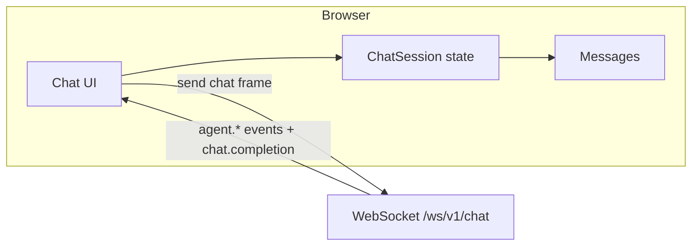

# Agent Layer — First-party Web UI (Plan & Architecture)

**Language:** This document is maintained in **English** (canonical for contributors and public repo).

Status: **Planning** (not a mandatory implementation baseline). Goal: a **thin**, maintainable frontend against the Agent Layer **without** requiring Open WebUI. Open WebUI may continue to use the same HTTP/WebSocket APIs in parallel.

Related: [WEBUI_CONTRACT.md](WEBUI_CONTRACT.md), [USER_DATA_AND_SECRETS.md](USER_DATA_AND_SECRETS.md), [WEBUI_DESIGNS.md](WEBUI_DESIGNS.md).

---

## 1. Goals

| Goal | Meaning |
|------|---------|
| **Thin UI** | Login, Chat, Profile, Studio (images), optional Dashboard — no feature parity with Open WebUI. |
| **Small bundles** | Route-based code splitting; no mega-dependencies without need; do not keep huge payloads in client state indefinitely. |
| **Clear boundaries** | UI talks only to the Agent Layer (REST/WebSocket); do not duplicate backend business rules. |
| **Maintainability** | Onboarding for contributors; documented tree; extensible later. |

---

## 2. Stack (locked for this project)

| Layer | Choice | Rationale |
|-------|--------|-----------|
| Framework | **React 18+** | Largest ecosystem (chat, streaming, dashboards), hiring / libraries. |
| Build | **Vite** | Fast dev UX, modern tree-shaking. |
| Styling | **Tailwind CSS** | Utility-first, aligns with common UI kits. |
| Components | **shadcn/ui** (Radix + Tailwind) | Copy-in components, full control. |
| Server state | **TanStack Query** | Cache, refetch, bounded retention per feature. |
| Client state (optional) | **Zustand** or minimal React Context | UI chrome only (sidebar, theme), not full chat history. |
| Transport | **REST + WebSocket** | Matches Agent Layer (`/auth/*`, `/v1/user/*`, `/ws/v1/chat`, `/v1/studio/*`). |

**Not required:** Svelte — despite Open WebUI; React chosen for velocity and ecosystem.

---

## 3. Repository location

**Recommendation:** new directory **`interfaces/agent-ui/`** (or `frontend/`), **separate** from **`interfaces/web/static`** (legacy HTML).

- **Build output** e.g. under `interfaces/web/static/app/` or serve **`dist/`** via FastAPI `StaticFiles` — decide when CI exists.
- **Do not** mix legacy plain HTML and the new SPA in one deploy without clear routes (`/app/*` vs `/` legacy).

---

## 4. Target folder tree

```
interfaces/agent-ui/
  package.json
  vite.config.ts
  tailwind.config.js
  tsconfig.json
  index.html
  public/
  src/
    main.tsx
    app/
      routes.tsx              # lazy-loaded routes
      providers.tsx           # QueryClient, optional theme
    features/
      auth/                   # login, tokens, refresh
      chat/                   # WebSocket, messages, streaming events
      profile/                # GET/PUT /v1/user/profile, persona
      studio/                 # catalog, checkpoints, jobs (data_url)
      dashboard/              # optional later
    shared/
      api/                    # fetch wrapper, base URL, auth headers
      types/                  # DTOs aligned with contract
      ui/                     # shadcn + local primitives
      lib/                    # utils (no duplicated domain rules)
    assets/
```

**Rule:** **`features/*`** = **bounded contexts** (DDD-light): each area owns screens, hooks, and API calls. **`shared`** = reusable technical code only.

---

## 5. DDD-light

Full DDD in the browser is rarely worth it. Here:

| Concept | Implementation |
|---------|----------------|
| **Bounded context** | `features/auth`, `features/chat`, `features/profile`, `features/studio` — strict import boundaries. |
| **Ubiquitous language** | Names and API fields **1:1** with [WEBUI_CONTRACT.md](WEBUI_CONTRACT.md) / OpenAPI (e.g. `primary_image.data_url`, `run_key`). |
| **Anti-corruption layer** | **`shared/api`**: HTTP/WebSocket adapters; map raw JSON → `shared/types`. Do not re-implement authz or encryption in the UI. |
| **Domain logic** | **Stays in Agent Layer (Python).** UI may validate form shapes only, not tenancy rules. |

---

## 6. Data volume & limits

| Problem | Mitigation |
|---------|------------|
| Huge chat history in RAM | **Virtualize** the message list (`virtua` / TanStack Virtual); optionally trim old messages or keep metadata only. |
| Large images (Studio) | Responses use `data_url` — do not retain every job in state; revoke object URLs after display. |
| React Query | Tune `gcTime` / `staleTime`; no unbounded query accumulation. |
| WebSocket events | Keep **current session** in state; on disconnect, truncate or reload history via REST if added later. |
| Bundle size | **`React.lazy` + `Suspense`** per route; heavy charts only in `dashboard` chunk. |

---

## 7. API surface (short)

- **Auth:** `POST /auth/login`, `POST /auth/refresh`, Bearer on protected routes.
- **Chat:** `WebSocket /ws/v1/chat` — events per contract (`agent.session`, `agent.llm_round`, …, `chat.completion`).
- **Profile:** `GET`/`PUT /v1/user/profile`, `GET`/`PUT /v1/user/persona`.
- **Studio:** `GET /v1/studio/catalog`, `GET /v1/studio/comfy/checkpoints`, `POST /v1/studio/jobs`.

Single **base URL** from `VITE_AGENT_LAYER_ORIGIN` (or Vite dev proxy).

---

## 8. Contract-first (single source of truth)

| Rule | Practice |
|------|----------|
| **No invented fields** | TypeScript types in `shared/types` derive from **[WEBUI_CONTRACT.md](WEBUI_CONTRACT.md)** and **OpenAPI** (`/openapi.json`, `/openapi/domains`). |
| **WebSocket events** | `type` strings and payloads **1:1** with server docs (`agent.session`, `agent.llm_round`, `chat.completion`, …). Optional: `shared/ws-events.ts` with literal unions + Zod in dev. |
| **Avoid drift** | Contract change → backend/docs first → UI types; PR checklist “contract bump?”. |
| **Generation (optional)** | Later: OpenAPI client or Zod from JSON Schema if ROI is clear. |

---

## 9. Auth & session (frontend)

| Topic | Recommendation |
|-------|----------------|
| **Access token** | Short-lived (~15m) — **`sessionStorage`** or **memory** to reduce XSS exposure; **`localStorage`** only with accepted risk. |
| **Refresh token** | **`httpOnly` cookie** only if Agent Layer sets cookies; else **localStorage** or memory-only access + re-login. **Pragmatic P1:** access in memory + refresh in `sessionStorage`, refresh via `POST /auth/refresh`. |
| **Auto-refresh** | Before expiry (`expires_in`), timer/interceptor; on 401, one refresh attempt then logout. |
| **WebSocket auth** | Match server: `Authorization: Bearer` on handshake **or** `?token=` — see [WEBUI_CONTRACT.md](WEBUI_CONTRACT.md) / `chat_websocket.py`. |
| **Multi-tab** | **BroadcastChannel** or `storage` event: logout in one tab clears others; or intentional “per-tab session” (simpler, inconsistent). |
| **Logout** | Clear tokens, React Query `clear()`, close WS, navigate to `/login`. |

No second user database in the browser — **identity is whatever the Agent Layer validates**.

---

## 10. Chat UI state model (conceptual)

Goal: avoid spaghetti during streaming and tool rounds.

| Concept | Meaning |
|---------|---------|
| **ChatSession** | `sessionId` (client or server), metadata (title, `effective_model` from `agent.session`), status `connecting \| ready \| error \| disconnected`. |
| **Message** | `id`, `role` (`user` \| `assistant` \| `system`), `content` (final text), optional `streamingBuffer`, `status` (`pending` \| `streaming` \| `done` \| `error`), optional `toolCalls?`. |
| **Streaming** | One assistant stub that grows **or** chunks until `chat.completion` — do not duplicate. |
| **Agent/tool events** | Optional `timeline: AgentEvent[]` for display only — not a second source of truth vs. messages. |
| **Retry** | User-driven “resend” = new user message or replay last prompt (product decision). |
| **Errors** | Separate `transportError` (WS dead) from `applicationError` (server `error` payload). |

**v1:** history in memory only; later optional REST “conversations” if the layer adds them.



---

## 11. Errors, retry, reconnect & degraded modes

| Topic | Recommendation |
|-------|----------------|
| **WebSocket reconnect** | Exponential backoff (e.g. 1s, 2s, 5s, cap 30s); max attempts or manual “Connect”. After reconnect: **no** silent duplicate sends — notify or restart session. |
| **REST (React Query)** | `retry: 1–2` for GET; **no** blind retry on non-idempotent POST (jobs, profile save). |
| **HTTP fallback** | If WS permanently fails: message + optional **`POST /v1/chat/completions`** if supported (non-streaming) — only if explicitly implemented. |
| **Partial answer** | On abort: mark message `error` or `incomplete`, not `done`. |
| **503 / network** | Toast + retry; no infinite loops. |

### Degraded / “soft failure” UX (production polish)

The UI should **not** treat all problems as binary offline. Distinguish at least:

| State | User-facing hint |
|-------|------------------|
| **Offline** | No network / WS cannot open — clear banner, retry. |
| **Slow / queued** | LLM or upstream slow — “still working…” spinner; optional heartbeat from events. |
| **Partial stream** | Chunks stalled — show last content + “stream paused” if no events for N seconds (tunable). |
| **Tool timeout** | Tool round exceeded — show `agent.tool_done` error or server message; offer retry. |
| **Backend degraded** | 503 / rate limit — backoff message, not infinite retries. |

Implement with **session-level status** + message-level flags; avoid blocking the whole app on one slow turn unless desired.

---

## 12. UI performance: rendering strategy

Data caps (section 6) are necessary but not sufficient for smooth chat UX.

| Topic | Recommendation |
|-------|----------------|
| **Virtualization** | Keep (TanStack Virtual / `virtua`) for long threads. |
| **Markdown** | **react-markdown** + **rehype-sanitize** (or equivalent) for assistant/user markdown; strip dangerous HTML. |
| **Code blocks** | **Shiki** (accurate, heavier) or **Prism** (lighter) — lazy-load language grammars; **one highlighter instance** or chunk per route to limit bundle. |
| **Message rows** | **`React.memo`** on row components keyed by `message.id` + stable props; avoid re-rendering the full list on every token if using incremental append. |
| **Diff / updates** | Prefer **updating one message’s content** during stream rather than replacing the whole messages array each tick (structural sharing or immer). |

---

## 13. Memory vs UI state (explicit rule)

| Rule | Statement |
|------|-----------|
| **Source of truth** | **Long-term memory, secrets, profile persistence, and RAG** live in the **Agent Layer and database**, not in the browser. |
| **UI state** | The SPA holds **ephemeral** view state: current conversation buffer, scroll position, form drafts, and **cached** API responses (TanStack Query) with TTL. |
| **Never** | Do not treat the UI as authoritative for “what the user knows” across sessions — after reload, **re-fetch** profile and re-authenticate as needed. |

This prevents future features (shared memory, multi-device) from fighting a fake “browser memory of record.”

---

## 14. Observability (optional, nice-to-have)

| Topic | Idea |
|-------|------|
| **Client logs** | Structured `console` wrapper in dev; optional opt-in telemetry later (privacy review first). |
| **Correlation** | Pass through **`prompt_id`**, **`run_key`** (studio), or future **trace id** from responses into UI debug panel. |
| **Debug panel** | Dev-only: last WS frames, last REST errors, effective model from `agent.session`. |

---

## 15. Roadmap

| Phase | Content |
|-------|---------|
| **P0** | Scaffold (Vite + React + TS + Tailwind + shadcn), health page, env example. |
| **P1** | Auth (login, token storage, refresh), protected route. |
| **P2** | Chat: WS, message list, state model (§10), reconnect (§11), degraded modes (§11), `chat.completion` / errors, rendering basics (§12). |
| **P3** | Profile editor (GET profile schema, PUT patch). |
| **P4** | Studio: catalog, checkpoint select, job submit, ``. |
| **P5** | Ship static `dist/`, CORS/reverse proxy, optional PWA. |

---

## 16. Non-goals (for now)

- Feature parity with Open WebUI (plugins, full RAG UI, all model toggles).
- A second backend beside FastAPI.
- Full DDD + event sourcing in the browser.

---

## 17. Next steps (review)

1. Approve stack + `interfaces/agent-ui/` location.  
2. Implement **P0** scaffold.  
3. Optional: link from root `README` (already references this doc).

---

## 18. Deployment: same container vs extra service

**Today:** the Agent Layer already serves **static files** from `interfaces/web/static` at **`/control`** (see `src/api/main.py` — `StaticFiles`). There is **no** separate frontend container in-repo unless you add compose yourself.

**For the new React app (`interfaces/agent-ui/`), you can choose:**

| Approach | How it works |
|----------|----------------|
| **A — Served by Agent Layer (typical for self-host)** | Run `npm run build`, copy **`dist/`** into the image (e.g. `interfaces/web/static/app/`) and **`app.mount("/app", StaticFiles(..., html=True))`** so `/app` loads the SPA; API stays on the same origin → simple CORS. **One container** for API + static UI. |
| **B — Separate container (e.g. nginx)** | Build the SPA in a **frontend** image; nginx serves static files and **proxies** `/` API traffic to `agent-layer:8088` (or whatever). **Two containers**; good if you want independent UI deploys or CDN. |
| **C — Dev only** | `vite dev` on the host with **proxy** to Agent Layer — no Docker change until production. |

**Option A in-repo:** `interfaces/agent-ui/` is a Vite+React app; `npm run build` writes to `interfaces/web/static/app/`. The image build runs that step and **`app.mount("/app", …)`** in `src/api/main.py` serves the SPA when `index.html` is present. `/app` is public in the auth middleware (same pattern as `/control/`).

---

## Changelog

| Date | Change |
|------|--------|
| 2026-04-09 | Initial plan (stack, DDD-light, data limits, phases). |
| 2026-04-09 | Added: contract-first, auth/session, chat state, errors/reconnect. |
| 2026-04-09 | **English-only** canonical doc; added: degraded modes, rendering (markdown/code/memo), memory vs UI rule, observability. |
| 2026-04-09 | §18 deployment: same Agent Layer container vs separate nginx-style service. |
| 2026-04-08 | §18 Option A: `interfaces/agent-ui`, Docker multi-stage build, `/app` static mount. |
